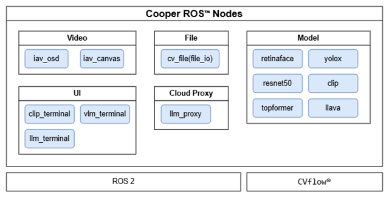
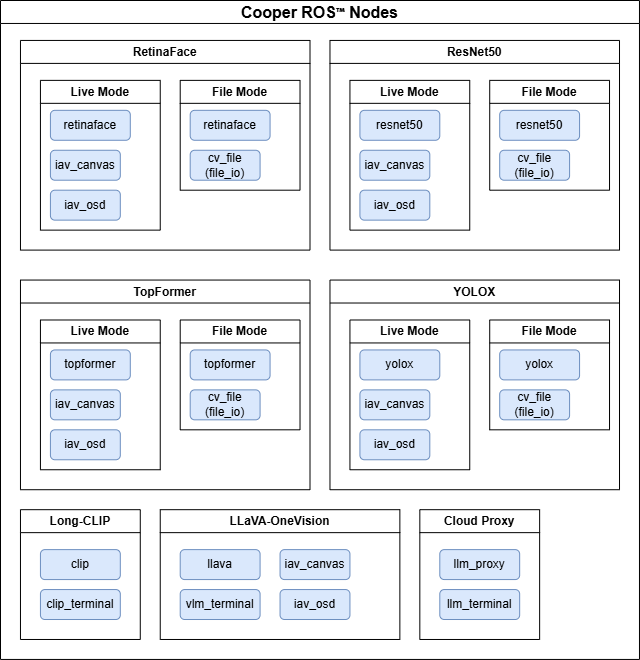
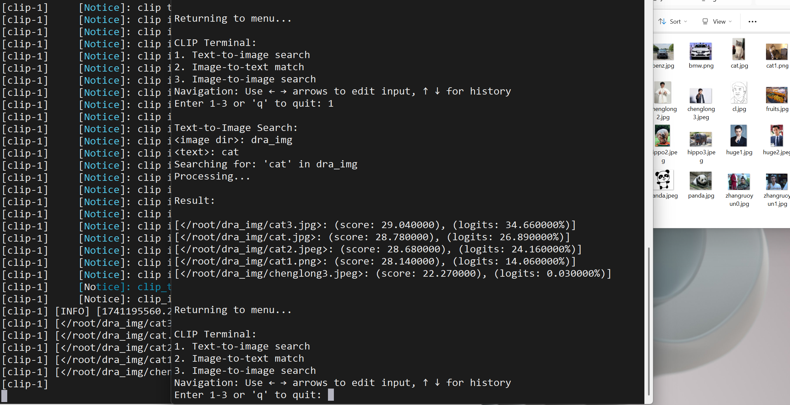
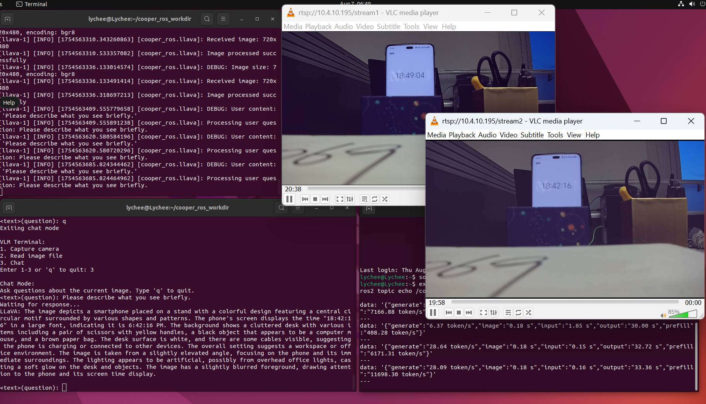
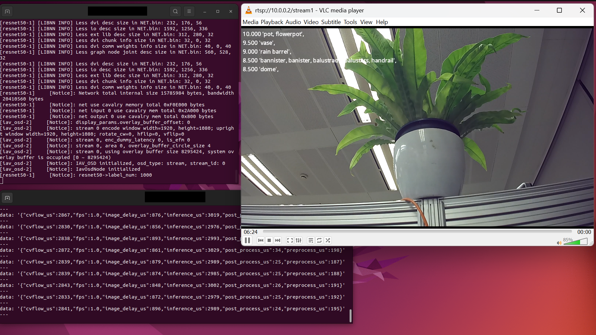
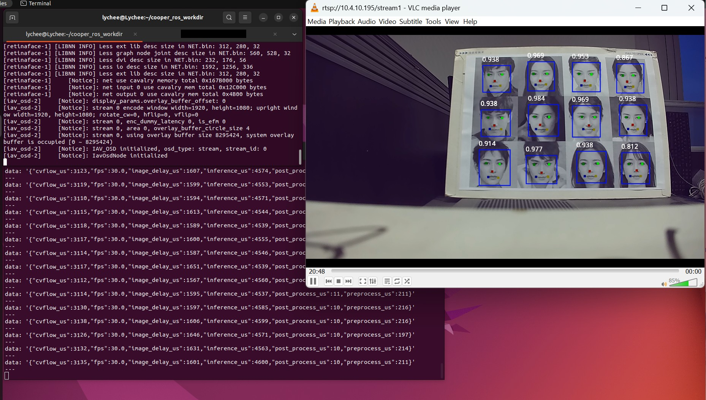
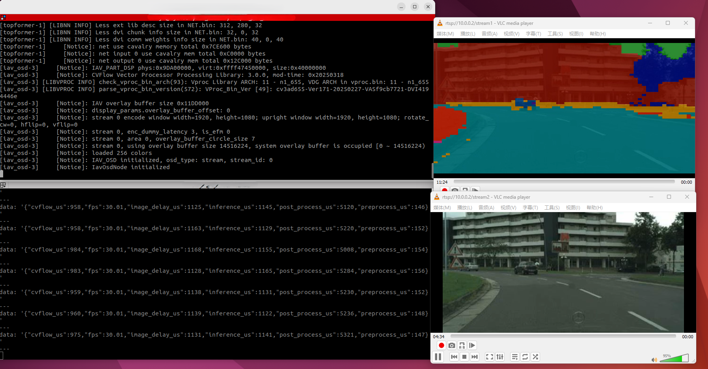
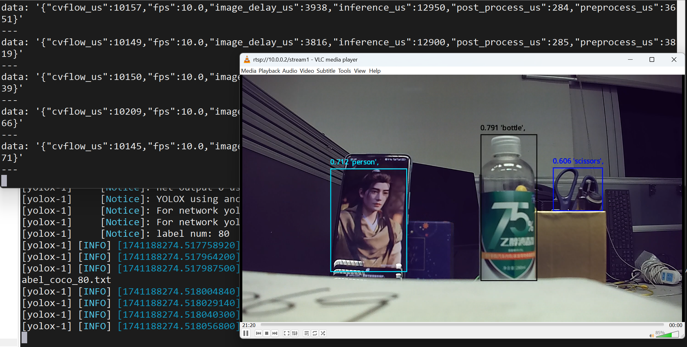

# Cooper ROS™

This project is part of the Cooper Robot Operating System (ROS) initiative, which offers source code for running deep neural networks (DNNs),
vision-language models (VLMs), and robotic algorithms using Cooper Foundry on ROS 2.  Note that ROS is a trademark of Open Robotics.
Currently supported models include the following:
- LongCLIP
- LLaVA-OneVision
- ResNet
- RetinaFace
- TopFormer
- YOLOX

It also provides proxies for Cooper Foundry on ROS 2 to access public generative artificial intelligence (AI) services.
Currently supported proxies include the following:
- Large language model (LLM)

Refer to the `README.md` in each package for instructions on running the demo and using the ROS interfaces.

- Nodes

    <p align="center">
        
    </p>

- Demos

    <p align="center">
        
    </p>

## Pre-conditions

- Hardware

    - Cooper Max / Cooper Pro / Cooper Mini
    - Camera os08a10_mipi_brg connected to VIN0-A

- Software development kit (SDK) version

    | Tag | Cooper Foundry | Cooper SDK |
    | --- | --------------- | ---------- |
    | v0.0.1 | 2.2 (Lychee OS Cooper SDK 2.5.1.1) | 2.5.2 |

- Converted model

    The pre-converted models can be downloaded from [model garden](https://huggingface.co/Ambarella/models).<br>

- Others

    Test image files.

## Build

- Lychee OS

    If Lychee OS is not upgraded, or the pre-built ROS 2 packages are not installed under `/opt/ros/`,
    follow the documentation below to upgrade.

    - **System Upgrade** (Section 3.14): Cooper Develop Platform -> Cooper Foundry -> Cooper <Max / Pro / Mini> Development Kit -> 3 System -> 3.* System Upgrade
    - **Upgrade Cooper SDK in Lychee OS** (Section 3): Cooper Develop Platform -> Lychee OS -> 3 Upgrade Cooper SDK in Lychee OS

    The following commands can be used to check the versions.

    ```bash
    test_encode --show-driver
    ```

    Record the pre-installed numpy version. If compatibility issues related to numpy occur, check whether the version has been changed.

    ```bash
    pip show numpy
    ```

    For building on Lychee OS with `Cooper Mini`, select the following `no-cvflow` boot option to increase the RAM size.
    After the building is complete, reboot to use the default boot option to run the demos.

    ```bash
    [lychee@Lychee ~]$ sudo reboot
    ...
    Lychee Boot Options.
    1:      Lychee(5.15.180-100.lch2025.aarch64)-cooper-mini
    2:      Lychee(5.15.180-100.lch2025.aarch64)
    3:      Lychee(5.15.180-100.lch2025.aarch64)-cooper-mini-no-cvflow
    3
    ```

    Follow the steps below to build Cooper ROS from the source on Lychee OS.

    1. Install dependency development packages.

        ```bash
        sudo dnf-3 config-manager --set-enabled lychee-updates
        sudo dnf install libtokenizers-cpp-devel

        # Installing `iperf3` is optional for network throughput test.
        sudo dnf install iperf3
        ```

    2. Make directories for colcon build.

        ```bash
        mkdir -p $HOME/cooper_ros_workdir/src
        WORKDIR=$HOME/cooper_ros_workdir
        ```

    3. Download dependency ROS 2 packages.

        ```bash
        cd $WORKDIR/src
        git clone https://github.com/ros-perception/vision_msgs.git
        ```

    4. Download the Cooper ROS source code.

        ```bash
        cd $WORKDIR/src/
        git clone https://github.com/Ambarella-Inc/cooper-ros.git cooper_ros
        ```

    5. Build using colcon.

        ```bash
        eval $(rpm --eval %set_build_flags)
        source /opt/ros/<ROS 2 distribution>/setup.bash # Change <ROS 2 distribution> to humble, jazzy, and more.
        cd $WORKDIR
        colcon build --packages-skip vision_msgs_rviz_plugins
        ```

- Yocto Build with Cooper SDK

    The steps below outline how to configure the Cooper ROS packages in the Yocto build,
    as part of the Yocto build process.
    Refer to the Cooper SDK Doxygen documentation for other Yocto build steps.

    The following configuration files included in the Cooper SDK have been tested.

    | Hardware | Configuration | Path |
    | -------- | ------------- | ---- |
    | Cooper Mini | cooper_mini_ros2_emmc_config | `boards/cv72_cooper_mini/config/yocto` |

    1. Download the Cooper ROS source code into the SDK.

        ```bash
        cd <SDK>/ambarella/app
        git clone https://github.com/Ambarella-Inc/cooper-ros.git cooper_ros
        ```

    2. Copy the recipe folder into the SDK.

        The recipe folder is `cooper_ros/assets/recipes-cooper-ros`.
        Copy it into the SDK folder `\<SDK\>/ambarella/metadata/meta-ambaapp`.

    3. Ensure that the dependences are selected in `menuconfig`.

        nlohmann-json

        ```bash
        build $ make menuconfig
            meta-oe  --->
                recipes-devtools  --->
                    [*] nlohmann-json (meta-oe/recipes-devtools/nlohmann-json)
        ```

        libtokenizers-cpp

        ```bash
        build $ make menuconfig
            meta-thirdparty  --->
                recipes-oss  --->
                    [*] libtokenizers-cpp (meta-thirdparty/recipes-oss/libtokenizers-cpp)
        ```

        Ensure that all non-developer packages located in `meta-ambalib/recipes-cavalry` are selected.

        ```bash
        build $ make menuconfig
            meta-ambalib  --->
                recipes-cavalry  --->
                    -*- libcavalrymem (meta-ambalib/recipes-cavalry/libcavalrymem)
                    ...
                    -*-     libshepherd (meta-ambalib/recipes-cavalry/libshepherd)
                    ...
        ```

        Ensure that all non-developer `libeazyai-*` are selected.

        ```bash
        build $ make menuconfig
            meta-ambalib  --->
                recipes-eazyai  --->
                    ...
                    [*] libeazyai-inf (meta-ambalib/recipes-eazyai/libeazyai)
                    [*] libeazyai-io (meta-ambalib/recipes-eazyai/libeazyai)
                    ...
        ```

    4. Select the necessary Cooper ROS packages in `menuconfig`.

        ```bash
        build $ make menuconfig
            meta-ambaapp  --->
                recipes-cooper-ros  --->
                    ...
                    [*] cooper-ros-cv-file (meta-ambaapp/recipes-cooper-ros/cooper-ros)
                    [ ]   cooper-ros-cv-file-dev (meta-ambaapp/recipes-cooper-ros/cooper-ros)
                    ...
                    [*] cooper-ros-retinaface (meta-ambaapp/recipes-cooper-ros/cooper-ros)
                    [ ]   cooper-ros-retinaface-dev (meta-ambaapp/recipes-cooper-ros/cooper-ros)
                    ...
        ```

    5. Select `pip` to install Python packages.

        ```bash
        build $ make menuconfig
            meta  --->
                recipes-devtools  --->
                    [*] python3-pip (meta/recipes-devtools/python)
        ```

    6. Select `rsync` to deploy files.

        ```bash
        build $ make menuconfig
            meta  --->
                recipes-devtools  --->
                    [*] rsync (meta/recipes-devtools/rsync)
        ```

    7. Select `iperf3` for network throughput test.

        ```bash
        build $ make menuconfig
            meta-oe  --->
                recipes-benchmark  --->
                    [*] iperf3 (meta-oe/recipes-benchmark/iperf3)
        ```

    8. Select the sensor driver if the sensor is not `camera os08a10_mipi_brg`.

        For example, `imx390_mipi_brg`

        ```bash
        build $ make menuconfig
            meta-ambabsp  --->
                recipes-sensor  --->
                    [*] kernel-module-imx390-mipi-brg (meta-ambabsp/recipes-sensor/kernel-module-imx390-mipi-brg)
        ```

    9. Increase free space of rootfs storage in case the storage is insufficient to install Python packages.

        One of the following methods can be used. However, it is not necessary to use all methods.

        1. Increase the rootfs margin.

            The following example increases the rootfs margin to 50% by adding <b>IMAGE_OVERHEAD_FACTOR = "1.5"</b>.

            ```bash
            vi <SDK>/ambarella/metadata/meta-ambabsp/conf/machine/include/ambarella-common.inc
            ...
            KERNEL_IMAGETYPE = "Image"
            SERIAL_CONSOLES ?= "115200;ttyS0"
            IMAGE_OVERHEAD_FACTOR = "1.5"
            ```

        2. Deselect the unnecessary configurations.

            Do not deselect `cv-cavalry-tool`, `cv-test`, `dsp-monitor-service`, `eazyai-test`, `iav-test`, `idsp-test`
            and `lwmedia-test` under `recipes-test`.

            ```bash
            build $ make menuconfig
                meta-ambaapp  --->
                    recipes-demos  --->
                        [] ...
                    recipes-ros2  --->
                        [] ...
                    recipes-test  --->
                        [] ...
                        [*] cv-cavalry-tool (meta-ambaapp/recipes-test/cv-test)
                        [*] cv-test (meta-ambaapp/recipes-test/cv-test)  --->
                        [*] dsp-monitor-service (meta-ambaapp/recipes-test/dsp-monitor-service)
                        [*] eazyai-test@virual (meta-ambaapp/recipes-test/eazyai-test)  --->
                        [*] iav-test (meta-ambaapp/recipes-test/iav-test)
                        [*] idsp-test (meta-ambaapp/recipes-test/idsp-test)  --->
                        [*] lwmedia-test (meta-ambaapp/recipes-test/lwmedia-test)
            ```

- Ubuntu ROS 2 with Cooper ROS Python packages

    Follow the steps below to build Cooper ROS Python packages from the source on Ubuntu ROS 2.

    1. Install dependencies.

        Install the <b>ros-\<ROS 2 distribution\>-desktop</b> package with the steps in the ROS 2 documentation.

    2. Make directories for colcon build.

        ```bash
        mkdir -p $HOME/cooper_ros_workdir/src
        WORKDIR=$HOME/cooper_ros_workdir
        ```

    3. Download dependency ROS 2 packages.

        ```bash
        cd $WORKDIR/src
        git clone https://github.com/ros-perception/vision_msgs.git
        ```

    4. Download the Cooper ROS source code.

        ```bash
        cd $WORKDIR/src/
        git clone https://github.com/Ambarella-Inc/cooper-ros.git cooper_ros
        ```

    5. Build using colcon.

        ```bash
        source /opt/ros/<ROS 2 distribution>/setup.bash # Change <ROS 2 distribution> to humble, jazzy, and more.
        cd $WORKDIR
        colcon build --packages-skip vision_msgs_rviz_plugins --packages-up-to cooper_ros_clip_terminal cooper_ros_cv_file cooper_ros_llm_proxy cooper_ros_vlm_terminal
        ```

## Install

- Lychee OS

    1. Connect to the network.

        ```bash
        # Run the GUI tool nm-connection-editor in Konsole on the desktop to configure the IP address, DNS, and more.
        nm-connection-editor
        ```

    2. Install the dependency Python packages.

        ```bash
        cd $WORKDIR
        pip install -r src/cooper_ros/requirements.txt
        ```

    3. Set up the packages.

        ```bash
        cd $WORKDIR
        source install/setup.bash
        ```

- Yocto Build of Cooper SDK

    1. Install the dependency Python packages in the firmware.

        - Connect to the network.

            ```bash
            # Configure the IP address, netmask, and gateway in /etc/systemd/network/11-eth0.network.
            # For example,
            vi /etc/systemd/network/11-eth0.network
                [Match]
                Name=eth0

                [Network]
                Address=10.0.0.2/24
                Gateway=10.0.0.1

            # Reboot to apply the configuration changes.
            reboot
            ```

        - Install the dependency packages.

            ```bash
            pip3 install opencv-python-headless==4.9.0.80 # The version matches OpenCV in Cooper SDK 2.5.2
            pip3 install openai>=1.0.0 # Only required by cooper_ros_llm_proxy
            ```

    2. Set up the packages.

        ```bash
        source /opt/ros/<ROS 2 distribution>/setup.bash
        ```

- Ubuntu ROS 2 with Cooper ROS Python packages

    1. Install the dependency Python packages.

        ```bash
        cd $WORKDIR
        pip install -r src/cooper_ros/requirements.txt
        ```

    2. Install the SSH server if required.

        ```bash
        sudo apt install openssh-server
        ```

    3. Set up the packages.

        ```bash
        cd $WORKDIR
        source install/setup.bash
        ```

## Run

1. Prepare the models.

    The pre-converted CVflow® models can be downloaded from the model garden on
    [Hugging Face](https://huggingface.co/Ambarella/models).<br>

    | Model | Cooper Max | Cooper Pro | Cooper Mini | Download |
    | ----- | ---------- | ---------- | ----------- | -------- |
    | LongCLIP | ✓ | ✓ | ✓ | [LongCLIP](https://huggingface.co/Ambarella/LongCLIP) |
    | LLaVA-OneVision | ✓ | ✓ | ✗ | [LLaVA-OneVision](https://huggingface.co/Ambarella/LLaVA-OneVision) |
    | ResNet | ✓ | ✓ | ✓ | [ResNet](https://huggingface.co/Ambarella/ResNet) |
    | RetinaFace | ✓ | ✓ | ✓ | [RetinaFace](https://huggingface.co/Ambarella/RetinaFace) |
    | TopFormer | ✓ | ✓ | ✓ | [TopFormer](https://huggingface.co/Ambarella/TopFormer) |
    | YOLOX | ✓ | ✓ | ✓ | [YOLOX](https://huggingface.co/Ambarella/YOLOX) |

    The names of the pre-converted CVflow model files start with chip names.

    | Device | Chip Name |
    | -------| --------- |
    | Cooper Max | N1 |
    | Cooper Pro | N1-655 |
    | Cooper Mini | CV72 |

    For the compressed packages in `LLaVA-OneVision`, use the commands below to decompress them.

    ```bash
    cd LLaVA-OneVision
    mkdir <package name>
    tar -xvf <package name>.tar -C <package name>
    ```

    The following Python tool can be used to download the model files from the model garden automatically.
    The tested model versions are specified in `model_garden_info.yaml` with commit hash.

    ```bash
    WORKDIR=$HOME/cooper_ros_workdir
    MODEL_GARDEN_DOWNLOAD_DIR=$WORKDIR/src/cooper_ros/assets/model_garden_download
    pip install -r $MODEL_GARDEN_DOWNLOAD_DIR/requirements.txt

    python3 $MODEL_GARDEN_DOWNLOAD_DIR/model_garden_download.py $MODEL_GARDEN_DOWNLOAD_DIR/model_garden_info.yaml <output dir>
    ```

    Use the Hugging Face mirror site when necessary.

    ```bash
    WORKDIR=$HOME/cooper_ros_workdir
    MODEL_GARDEN_DOWNLOAD_DIR=$WORKDIR/src/cooper_ros/assets/model_garden_download
    pip install -r $MODEL_GARDEN_DOWNLOAD_DIR/requirements.txt

    export HF_ENDPOINT=https://hf-mirror.com
    python3 $MODEL_GARDEN_DOWNLOAD_DIR/model_garden_download.py $MODEL_GARDEN_DOWNLOAD_DIR/model_garden_info.yaml <output dir>
    ```

2. Run the demos.

    Refer to the `README.txt` in packages for information on how to run demos.<br>

    For each model with an image input, the image will be resized to match the model's input without padding.
    As a result, the input image's aspect ratio will be changed to the model's input aspect ratio.
    If the change in aspect ratio exceeds the model's detection tolerance,
    noticeable accuracy loss may occur.
    For best results, ensure the input image's aspect ratio is close to the model's input aspect ratio.

    The network interfaces below are used in the test of this project.

    | Device | Network Interface |
    | -------| --------- |
    | Cooper Max | end0 |
    | Cooper Pro | end0 |
    | Cooper Mini | end0 |

    By default, all the connected network interfaces are used in ROS 2 transport.
    If the blazenet@0x network interfaces are connected, they become discoverable by peer machines even without a direct connection.
    As a result, peer machines will send packets to their IP addresses, which wastes bandwidth and leads to communication failures
    on Cooper Max when all three blazenet@0x network interfaces are connected.

    Users can use one of the methods below to resolve the network interface issue.

    - Disconnect the unused network interfaces.

        This method is used when testing the demos.

    - Add an interface whitelist to an XML file.

        Refer to [Interface Whitelist](https://fast-dds.docs.eprosima.com/en/2.14.x/fastdds/transport/whitelist.html).

        In `fast_dds_whitelist.xml`, the IP address 192.168.1.11 is used as an example.

        ```xml
        <?xml version="1.0" encoding="UTF-8" ?>
        <profiles xmlns="http://www.eprosima.com">
            <transport_descriptors>
                <transport_descriptor>
                    <transport_id>CustomTcpTransportWhitelistAddress</transport_id>
                    <type>UDPv4</type>
                    <interfaceWhiteList>
                        <address>192.168.1.11</address>
                    </interfaceWhiteList>
                </transport_descriptor>
            </transport_descriptors>

            <participant profile_name="CustomTcpTransportWhitelistAddressParticipant" is_default_profile="true">
                <rtps>
                    <useBuiltinTransports>false</useBuiltinTransports>
                    <userTransports>
                        <transport_id>CustomTcpTransportWhitelistAddress</transport_id>
                    </userTransports>
                </rtps>
            </participant>
        </profiles>
        ```

        ```bash
        export FASTRTPS_DEFAULT_PROFILES_FILE=<the path to fast_dds_whitelist.xml>
        ```


    To ensure reliable image publishing, a network connection with a bandwidth of at least 1 gigabit per second (Gbps) is recommended.
    Utilizing a connection at 100 megabits per second (Mbps) or lower may result in failures due to insufficient data throughput.

    Users can use the commands below to test the network throughput.

    ```bash
    # server
    iperf3 -s -p 5201

    # client
    iperf3 -c <server IP> -p 5201 -u -b 1G -t 10 -i 1 --get-server-output -l <block size, 16 ~ 65507>
    ```

    If nodes cannot stably receive the image messages due to user datagram protocol (UDP) package loss, especially in cross-machine communication,
    try one of the following configuration steps before launching demos.
    Refer to [Very slow publishing of large messages](https://github.com/ros2/ros2/issues/1242)
    for information about large messages issues,
    [FASTDDS_BUILTIN_TRANSPORTS](https://fast-dds.docs.eprosima.com/en/stable/fastdds/env_vars/env_vars.html) and
    [Large Data](https://fast-dds.docs.eprosima.com/en/stable/fastdds/use_cases/tcp/tcp_large_data_with_options.html)
    for some eProsima Fast Data Distribution Service (DDS) configurations.

    - With Fast Real-Time Publish-Subscribe (RTPS) profiles in XML file

        `large_message_profile.xml`

        ```xml
        <?xml version="1.0" encoding="UTF-8" ?>
        <dds>
            <profiles xmlns="http://www.eprosima.com/XMLSchemas/fastRTPS_Profiles" >
                <transport_descriptors>
                    <transport_descriptor>
                        <transport_id>TransportId1</transport_id>
                        <type>UDPv4</type>
                        <maxMessageSize>1400</maxMessageSize>
                    </transport_descriptor>
                </transport_descriptors>

                <participant profile_name="participant_profile" is_default_profile="true">
                    <rtps>
                        <userTransports>
                            <transport_id>TransportId1</transport_id>
                        </userTransports>
                        <useBuiltinTransports>false</useBuiltinTransports>
                    </rtps>
                </participant>

                <publisher profile_name="default publisher profile" is_default_profile="true">
                    <qos>
                        <publishMode>
                            <kind>SYNCHRONOUS</kind>
                        </publishMode>
                    </qos>
                    <historyMemoryPolicy>PREALLOCATED_WITH_REALLOC</historyMemoryPolicy>
                </publisher>
                <subscriber profile_name="default subscriber profile" is_default_profile="true">
                    <historyMemoryPolicy>PREALLOCATED_WITH_REALLOC</historyMemoryPolicy>
                </subscriber>
            </profiles>
        </dds>
        ```

        ```bash
        export RMW_IMPLEMENTATION=rmw_fastrtps_cpp
        export FASTRTPS_DEFAULT_PROFILES_FILE=<the path to large_message_profile.xml>
        export RMW_FASTRTPS_USE_QOS_FROM_XML=1
        ```

    - With limited UDP over IPv4 (UDPv4) message size

        ```bash
        export RMW_IMPLEMENTATION=rmw_fastrtps_cpp
        export FASTDDS_BUILTIN_TRANSPORTS=DEFAULT?max_msg_size=1400B&sockets_size=1400B&non_blocking=false
        ```

    - Using transmission control protocol over IPv4 (TCPv4) for large data

        ```bash
        export RMW_IMPLEMENTATION=rmw_fastrtps_cpp
        export FASTDDS_BUILTIN_TRANSPORTS=LARGE_DATA?max_msg_size=1MB&sockets_size=1MB&non_blocking=true&tcp_negotiation_timeout=50
        ```

## Preview

- LongCLIP

    <p align="center">
        
    </p>

- LLaVA-OneVision

    <p align="center">
        
    </p>

- ResNet

    <p align="center">
        
    </p>

- RetinaFace

    <p align="center">
        
    </p>

- TopFormer

    <p align="center">
        
    </p>

- YOLOX

    <p align="center">
        
    </p>

## Known Issues

- Using 1920x1080 images in the `cooper_ros_llava` demo will cause a segmentation fault
in the `cooper_ros_iav_osd/iav_osd` node. This issue will be fixed in the release after Cooper SDK 2.5.2.
It can also be reproduced by feeding a 1080x1920 image to
the encode from memory (EFM) image subscription topic of cooper_ros::iav_osd::IavOsdNode,
when the EFM stream has a 1920x1080 resolution.
